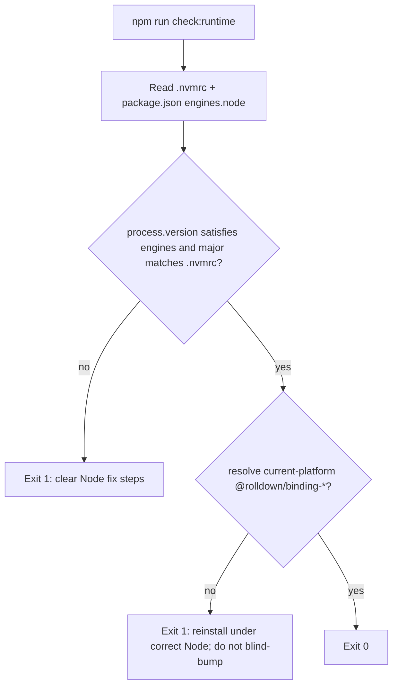

# Node / jsdom / Rolldown runtime guardrails

## Decision: Node single source of truth

Keep Vite 8; stop lying with `engines: ">=20"` and `.nvmrc` `20`.

| Source                                        | Value                               | Rationale                                                                                                              |
| --------------------------------------------- | ----------------------------------- | ---------------------------------------------------------------------------------------------------------------------- |
| [`.nvmrc`](.nvmrc)                            | `22`                                | Major LTS line; matches [weekly-guardrail-review](.github/workflows/weekly-guardrail-review.yml) (compares major only) |
| [`package.json` `engines.node`](package.json) | `>=22.12.0`                         | Matches Vite/Rolldown floor; **rejects 22.11.0** (the consumer gap)                                                    |
| CI                                            | already `node-version-file: .nvmrc` | No matrix change; setup-node installs current Node 22.x (≥22.12 on Actions)                                            |

`check:runtime` enforces `engines.node` (and that the running major matches `.nvmrc` when `.nvmrc` is a bare major). That is the durable fix for “`.nvmrc` says 22 / PATH has 22.11”.

**Not chosen:** pin `.nvmrc` to `22.13` (would break the weekly LTS bot without a separate fix); keep dual `^20.19 \|\| >=22.12` (leaves the SoT split in place).

## Decision: jsdom pin

In hub [`package.json`](package.json) (and thus starter via EXTRA sync):

- Change `"jsdom": "^29.1.1"` → `"jsdom": "^26.1.0"`
- Regenerate lockfile with `npm install` under supported Node

Field + upstream consensus: jsdom ≥27 pulls `html-encoding-sniffer` → `@exodus/bytes` (ESM-only) via `require()`, which breaks Vitest/jsdom bootstrap in several environments; **26.1.0** is the known-good workaround. `^26.1.0` allows 26.x patches but cannot float to 27+/29 without an intentional range edit.

No CHANGELOG.md in repo — document in [`docs/guardrail-upgrade-observations.md`](docs/guardrail-upgrade-observations.md).

## `check:runtime` design

New script: [`.github/scripts/check-runtime.mjs`](.github/scripts/check-runtime.mjs) (same home as [`check-manifest-drift.mjs`](.github/scripts/check-manifest-drift.mjs)).



**Checks:**

1. **Node** — parse `engines.node` as a simple `>=x.y.z` floor (no new `semver` dependency; document that engines must stay this shape). Fail if `process.versions.node` is below the floor or major ≠ `.nvmrc` major.
2. **Rolldown binding** — map `process.platform` + `process.arch` (+ linux musl vs gnu via `process.report.getReport()` / `ldd` heuristic only if needed) to `@rolldown/binding-*`, then `createRequire(...).resolve(...)`. Covers Windows `binding-win32-*` and Ubuntu CI `binding-linux-x64-gnu` on the machine that runs the check.

**Error copy (must be actionable):**

- Wrong Node: cite required range + `.nvmrc`; tell user to fix Node manager/PATH (`nvm use` / `fnm use` / install ≥22.12), then `rm -rf node_modules && npm ci` — do not bump Vite/Vitest to “fix” it.
- Missing binding: explain optional native install was skipped (often engine gap); same reinstall path; do not delete tests or pin Vite without an engines decision.

**npm script:** `"check:runtime": "node .github/scripts/check-runtime.mjs"`

**Self-test (no Vitest pattern for `.github/scripts/`):** `--self-test` flag covering version-floor and binding-name mapping fixtures (mirror [`audit.mjs --self-test`](.cursor/hooks/audit.mjs)). Optional `--node-version=22.11.0` override for local proof of the fail path without switching the shell Node.

**CI wire-in** — [`ci.yml`](.github/workflows/ci.yml) `verify` job, after `npm ci`, **before** Typecheck/Lint/Test (fail fast; no new job; branch-protection job names unchanged):

```yaml
- name: Check runtime
  run: npm run check:runtime
```

Also run `--self-test` in the same step or a one-liner after (cheap).

## Hub ↔ starter sync

| Change                      | Propagation                                                                       |
| --------------------------- | --------------------------------------------------------------------------------- |
| `.nvmrc`, `CONTRIBUTING.md` | Layer 2 — already synced                                                          |
| `ci.yml`                    | Layer 5 — already synced                                                          |
| `package.json` / lockfile   | EXTRA in [`sync-starter-template.mjs`](.github/scripts/sync-starter-template.mjs) |
| `check-runtime.mjs`         | **Add** to `EXTRA` next to `check-manifest-drift.mjs`                             |

No `templateMeta` changes. After merge to hub `main`, existing `sync-starter-template` workflow opens the starter PR; no manual starter edit in this change set unless sync is run dry locally for verification.

Bump [`.cursor/guardrail-version`](.cursor/guardrail-version) `1.5.0` → `1.5.1` and `guardrailVersion` / `lastUpdated` in [`guardrail-layers.json`](guardrail-layers.json).

## Docs (tight)

1. [`docs/guardrail-upgrade-observations.md`](docs/guardrail-upgrade-observations.md) — replace roadmap bullet “Node version upgrade path… when ready” with a **resolved** note: Node 22 + `engines >=22.12.0`; jsdom `^26.1.0` pin + why; point to `check:runtime`.
2. [`CONTRIBUTING.md`](CONTRIBUTING.md) — prerequisites say Node 22 / `.nvmrc`; add `check:runtime` to the commands table; short **Troubleshooting** blurb for (a) jsdom / `ERR_REQUIRE_ESM` / `@exodus/bytes`, (b) missing `@rolldown/binding-*` / wrong Node (fnm/PATH).
3. [`README.md`](README.md) — one-line `nvm use` + Node 22; mention `npm run check:runtime` after install.
4. [`playbook.html`](playbook.html) — update the “install Node 20 LTS” onboarding cell to Node 22 (hub-only, but currently contradicts the decision).

## Proof (implementation phase)

- Good path: `npm run check:runtime` → exit 0; then `npm run typecheck`, `lint`, `test`.
- Bad Node: `node .github/scripts/check-runtime.mjs --node-version=22.11.0` → non-zero + clear message.
- Missing binding: temporarily rename/move the resolved binding dir (or env override in self-test) → non-zero + reinstall guidance.
- Confirm lockfile has `jsdom` in the 26.1.x line, not 29.x.

## Out of scope (explicit)

- Consumer PowerShell/fnm install from the repo
- `npm audit fix --force` / unrelated major bumps
- Pinning or downgrading Vite
- Changing weekly LTS bot beyond what major-`22` already supports
