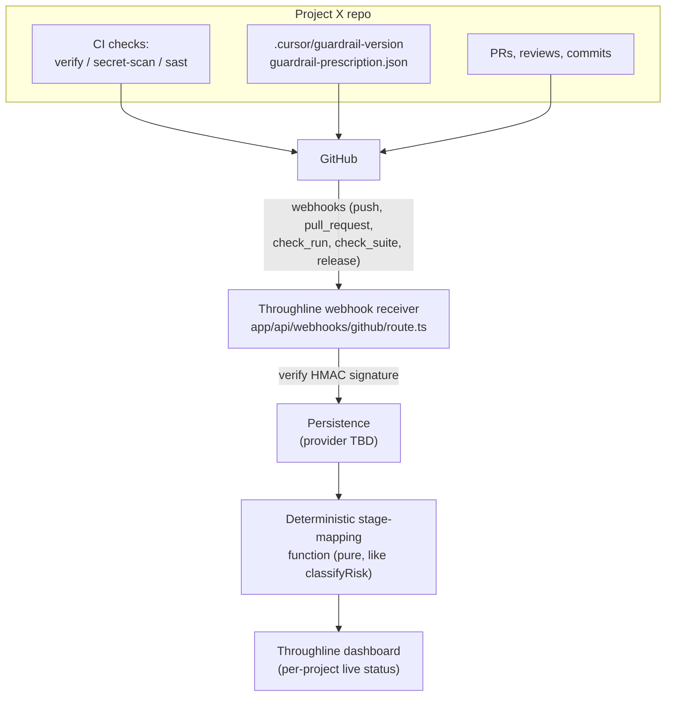

# Throughline GitHub App monitoring integration

> Status: DRAFT — not yet approved for execution. Written per the "plan before
> non-trivial changes" rule in `.cursor/rules/00-core.mdc`. Two blocking
> decisions (persistence provider; who performs the GitHub App registration)
> are called out at the end and must be answered before any implementation
> starts, because they involve new secrets/infra that an agent cannot decide
> or create unilaterally.

## Goal

Give Throughline the closest practical integration with Project X to monitor
its development, per the user's decision:

- **Signals:** both deterministic health signals (CI status, coverage,
  guardrail-version drift, commit-convention compliance) AND live progression
  through the 8 Build-track lifecycle stages (`docs/project-lifecycle.md`).
- **Mechanism:** a GitHub App — the deepest, most real-time integration GitHub
  supports, accepting the larger build and security surface that comes with
  it (webhooks, a private key, and persistence).

## Grounding (confirmed by reading the actual repos, not assumed)

- **Throughline today has zero monitoring infrastructure.** One API route
  (`app/api/propose/route.ts` — the single, deliberately isolated place AI is
  called), no database, state lives only in the browser
  (`src/lib/session-store.tsx`). Adding monitoring is a genuine new capability,
  not a tweak.
- **cursor-guardrails' CI already exposes exactly the deterministic signals
  needed, with stable names, with zero CI changes required:**
  - `Typecheck, lint, test, build` (job `verify`, [.github/workflows/ci.yml](.github/workflows/ci.yml) line 19)
  - `Secret scan (gitleaks)` (job `secret-scan`, line 85)
  - `SAST (Semgrep OWASP Top Ten)` (job `sast`, line 97)
  - Coverage is produced inside the `verify` job; `.cursor/guardrail-version`
    is a file in the repo the App can read directly via the Contents API.
    A GitHub App with read-only Checks + Contents + Pull requests scopes can
    read all of this without Project X's CI ever needing to "push" anything.

## Architecture

Two new pure/deterministic pieces sit alongside the existing `classifyRisk()`
and `getGuardrailProfile()` — never touched by the one AI-call route:

1. **Webhook ingestion** — verifies the GitHub HMAC signature, extracts only
   factual fields (check-run name + conclusion, PR review state, commit SHA,
   file paths changed), discards everything else. No AI, no interpretation.
2. **Stage-mapping function** — a rule table, not a model call, deriving
   "which of the 8 stages is this project in" from the facts above:

   | Stage                | Deterministic signal                                                                          |
   | -------------------- | --------------------------------------------------------------------------------------------- |
   | 1 Discover & Define  | Initiative exists in Throughline + first commit observed                                      |
   | 2 Design             | A plan file path matching `.cursor/plans/*.md` present in a commit                            |
   | 3 Build              | Commits present on a non-default branch; no green CI yet                                      |
   | 4 Verify             | Latest `Typecheck, lint, test, build` check = success                                         |
   | 5 Secure             | `Secret scan (gitleaks)` and `SAST (Semgrep OWASP Top Ten)` both = success on the same commit |
   | 6 Review             | Open PR with >=1 approving review                                                             |
   | 7 Release            | PR merged to default branch + all 3 checks green on that merge commit                         |
   | 8 Operate & Maintain | Ongoing after first release: tracks `.cursor/guardrail-version` drift + Dependabot PR status  |

   This table should be encoded once, as data, and shared — see "Where it
   lives" below — the same pattern `guardrail-layers.json` already uses for
   `riskTiers` and `projectProfiles`, so Throughline doesn't hardcode a
   second copy that can drift from this repo's own stage definitions.

## Where each piece lives (repo split, same pattern as the existing prescription work)

**cursor-guardrails (this repo, built directly):**

- Add a `lifecycleStages` block to [guardrail-layers.json](guardrail-layers.json) encoding the table above as data (stage number, name, `detectionSignals` — the exact check names and file-path patterns), so it's machine-readable instead of only prose in `docs/project-lifecycle.md`. Additive schema change: `schemaVersion` 3 -> 4, `guardrailVersion` minor bump (1.3.5 -> 1.4.0) per the existing "new layer/mapping added -> minor bump" convention.
- Update `docs/project-lifecycle.md` to reference the new manifest block as the canonical source instead of only prose.
- Add `docs/connect-guardrails.md` section: "Path B+ — deep integration (GitHub App)" — what installing the App unlocks, exact read-only permission scopes, and that it is opt-in per repo (never org-wide by default).
- New `docs/throughline-github-app-prompt.md` — the paste-ready prompt for Throughline's own Cursor session (same pattern as `docs/throughline-integration-prompt.md` and `docs/throughline-lifecycle-prompt.md`), covering: reading `lifecycleStages` from the vendored manifest, building the webhook route + signature verification, building the pure stage-mapping function against that data, and a persistence adapter — written to plug in whichever provider is chosen (see open decision below), not hardcoded to one.
- Version bump + `schemaChangelog` entry; validate + manifest-drift check + lint/typecheck; commit on a feature branch; PR (never push to `main`).

**Throughline (separate private repo, ships as the prompt above — no direct edits from here):**

- GitHub App registration (manual, human-only — see blocking decision below).
- New persistence layer (provider TBD).
- `app/api/webhooks/github/route.ts` — signature-verified webhook receiver.
- Stage-mapping function + tests (pure, deterministic, mirrors `classifier.ts`'s own discipline).
- Dashboard surfacing live stage + health signals per connected project.

## Hard constraints carried into the Throughline prompt

- Webhook ingestion and stage-mapping are pure/deterministic — no AI call, ever — kept as separate files from `app/api/propose/route.ts`, the one sanctioned AI boundary.
- GitHub App permissions are read-only (Contents, Pull requests, Checks/Statuses, Metadata) — never write/admin scopes.
- Per-repo opt-in only — installing the App on Project X is a deliberate, visible action, never automatic.
- Webhook secret and App private key are environment secrets, never committed — consistent with this repo's own hard stop on secrets in source.

## Two decisions — defaulted (no response given; documented so they're easy to override)

1. **Persistence provider: a managed serverless Postgres (e.g. Neon), not a KV/cache store.** Rationale: this is a governance tool for a regulated insurer — an auditable history of stage transitions and webhook events has real value, which favours relational/timestamped storage over a key-value cache. If this default is wrong, swap the provider name in `docs/throughline-github-app-prompt.md` — the schema/queries described there are ordinary relational tables, not Postgres-specific syntax.
2. **GitHub App registration: ships as explicit step-by-step instructions embedded in the prompt, run by a human when the prompt reaches that step.** There is no alternative — creating a GitHub App (name, permissions, webhook URL, private key) is a manual GitHub UI action only a human with admin rights can perform; an agent cannot do this regardless of preference.

## Out of scope (this pass)

- Auto-advancing a project through stages inside Throughline's own UI as a workflow action (display/detection only, per the earlier `docs/throughline-lifecycle-prompt.md` Step 3b guardrail).
- Any write/control action back to Project X (App stays read-only).
- Building the persistence layer or webhook route in this repo — those are Throughline-side, delivered as a prompt only.
