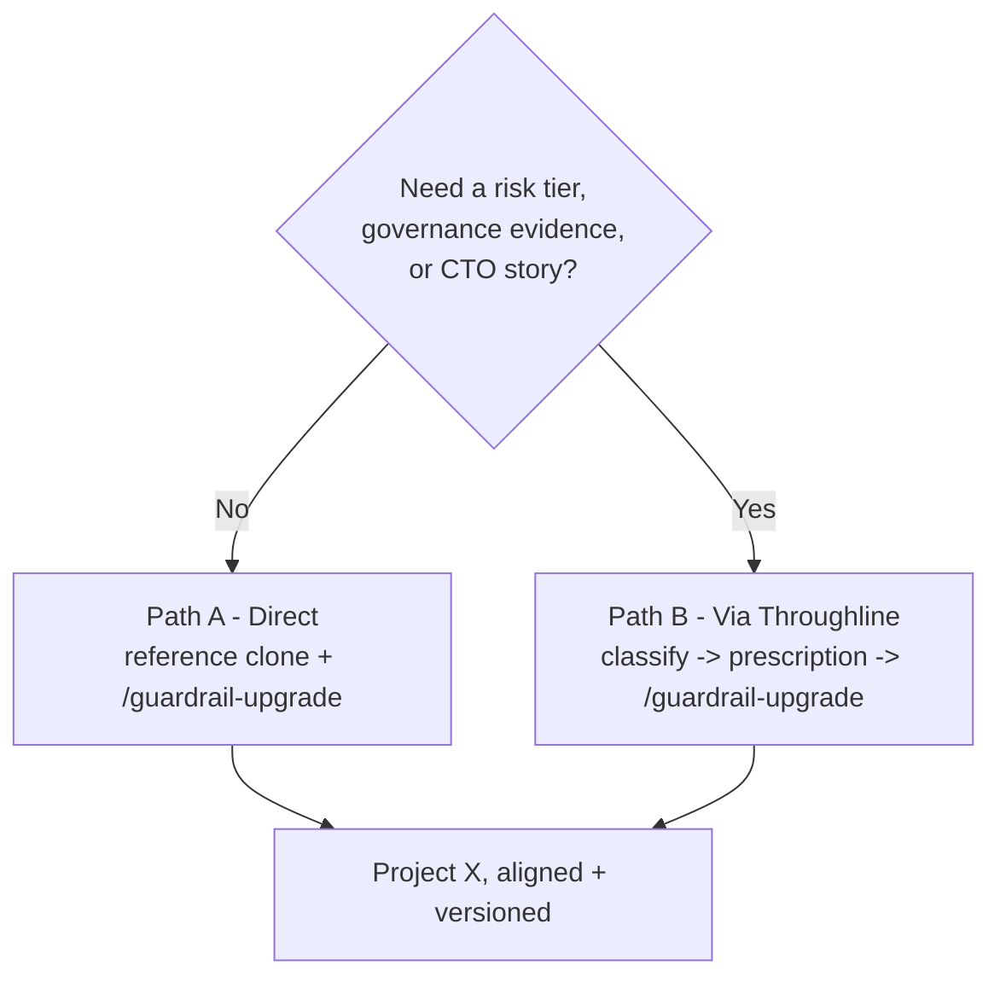

# Connecting Cursor Guardrails to a project

There are two ways to get the cursor-guardrails standard onto a project ("Project X"). Both end at the same place — Project X gains the rules, hooks, toolchain, and CI defined by this template — but they start differently and suit different situations. This page is the single, step-by-step answer to "how do I connect these things."

---

## Which path?

|                                | **Path A — Direct**                                           | **Path B — Via Throughline**                                                                     |
| ------------------------------ | ------------------------------------------------------------- | ------------------------------------------------------------------------------------------------ |
| Use when                       | You just want the guardrails on a project, with minimal setup | The project needs a documented risk tier, governance evidence, or the CTO-facing lifecycle story |
| Who decides which layers apply | You, by answering 3 quick questions                           | Throughline's deterministic Schedule A classifier                                                |
| Extra artefact produced        | None                                                          | `guardrail-prescription.json` (an auditable record of the tier and required layers)              |
| Executor                       | `/guardrail-upgrade` (reads a reference clone)                | `/guardrail-upgrade` (reads a reference clone **and** the prescription)                          |

Path B is Path A with Throughline supplying the profile instead of the 3 questions — see "How the two relate" below. If you are not using Throughline, use Path A; there is no wrong choice, only a question of whether you need Throughline's classification layered on top.

---

## Path A — Direct (Cursor Guardrails to Project X)

1. **Get a reference clone.** If you don't already have one, create it once, anywhere outside Project X: `git clone https://github.com/AGM82/cursor-guardrails`. Use a plain clone — **not** GitHub's "Use this template" button. That button is for starting a brand-new project (see Path A vs starting fresh, below); it makes a disconnected copy with no link back to this repo, so it could never receive updates. A plain clone stays linked, so it can be refreshed with `git pull`.
2. **Point at it.** In the playbook app, set "Reference clone path on this machine" to that folder. If you're not using the app, just have the path ready to paste.
3. **Open Project X in Cursor** and start a new Agent chat.
4. **Paste the bootstrap prompt** (from the playbook's "Adopt on existing project" tab, or [`docs/bootstrap-guardrail-upgrade.md`](./bootstrap-guardrail-upgrade.md)). It works day zero — nothing needs to be in place first. It refreshes the reference clone automatically before reading anything from it.
5. **Answer 3 quick questions** (project type, risk level, existing toolchain) — the agent turns your answers into a recommended layer set.
6. **Approve layers.** Review the gap analysis, then approve the layers you want applied (or reply `all`).
7. **Verify.** Run `npm run typecheck`, `npm run lint`, `npm run test` (skip any that don't exist yet) and fix anything the agent flags.

Once `.cursor/commands/` exists in Project X, all future runs are just `/guardrail-upgrade` in Agent chat — no need to re-paste the bootstrap prompt.

## Path B — Via Throughline (Cursor Guardrails to Throughline to Project X)

1. **Classify in Throughline.** Describe Project X in Throughline; its deterministic Schedule A classifier returns a risk tier (Low / Medium / High) and, via the vendored `guardrail-layers.json`, the required layers for that tier.
2. **Download the prescription.** From Throughline's Build Package, download `guardrail-prescription.json` — see [`docs/guardrail-prescription.md`](./guardrail-prescription.md) for exactly what it contains.
3. **Drop it into Project X**, at the project root (or `.cursor/`).
4. **Run `/guardrail-upgrade`** in Project X (bootstrap it first via Path A step 1–4 if this is day zero). The command detects the prescription file automatically, checks it isn't stale against the reference clone's version, and uses its tier and required layers directly — **skipping the 3 profiling questions**.
5. **Approve layers and verify** — same as Path A steps 6–7.

## How the two relate

Both paths end up running the exact same executor (`/guardrail-upgrade`, reading the same reference clone) against Project X. The only difference is _who_ decides the recommended layer set:

- **Path A:** you answer 3 questions inline.
- **Path B:** Throughline answers them for you, deterministically, and hands the answer over as a file — so the decision is auditable and doesn't have to be re-made (or accidentally re-answered differently) at execution time.

Nothing about the guardrail files themselves — rules, hooks, CI, toolchain — ever flows through Throughline. Those always come directly from the reference clone. Throughline only ever supplies the _prescription_ (which layers, and why), never the _files_.

## New project vs. adopting on an existing one

If you are starting a brand-new project rather than adopting on Project X, use GitHub's **Use this template** button instead of a plain clone — see the "Start a new project" tab in the playbook, or the README's "Setup (new project)" section. That creates your own independent repo with no live link back to `cursor-guardrails`, which is correct for a new project. To receive future guardrail improvements in that new project later, keep a separate reference clone (as in Path A step 1) and run `/guardrail-upgrade` inside it — the same tool described above.

## See also

- [`docs/guardrail-prescription.md`](./guardrail-prescription.md) — the `guardrail-prescription.json` contract
- [`docs/bootstrap-guardrail-upgrade.md`](./bootstrap-guardrail-upgrade.md) — day-zero bootstrap prompt (Path A)
- [`docs/throughline-lifecycle-prompt.md`](./throughline-lifecycle-prompt.md) — aligning Throughline to emit the prescription (Path B)
- [`docs/project-lifecycle.md`](./project-lifecycle.md) — the wider build/maintain lifecycle both paths feed into
- [`docs/guardrail-layers.md`](./guardrail-layers.md) — the manifest both Throughline and `/guardrail-upgrade` read from
