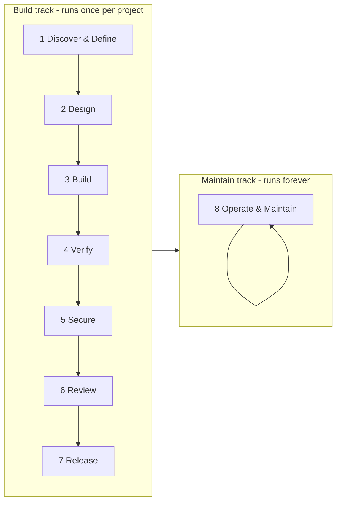

# Project lifecycle: two tracks, market-standard stages

This is the CTO-facing answer to "are we just vibe coding?" — no. Every project following cursor-guardrails moves through the same recognized software-development lifecycle (SDLC) stages as any disciplined engineering team, with a machine-enforced gate at nearly every one. AI does the work; the gates decide whether it's good enough to proceed. This document names the stages and points at the evidence for each.

---

## Two tracks, not one line

A project has two fundamentally different kinds of activity, and conflating them blurs both:

- **Build track** — runs **once** per project, start to finish. Mostly creative and forward-moving: turning an idea into a shipped, governed piece of software.
- **Maintain track** — runs **forever**, on a loop. Mostly checking and enforcing: keeping a shipped project aligned as the guardrail standard, dependencies, and the project itself evolve.

The Guardrails to Throughline to Project X upgrade chain — weekly guardrail improvements flowing down through Throughline's classification into a project — is a **Maintain-track** activity (Stage 8). See [`docs/connect-guardrails.md`](./connect-guardrails.md) for how a project connects into that chain in the first place.

## Deterministic core rule

Some stages are generative (an AI drafts something a human must approve); others are decision/check stages that must stay pure and auditable. Never blend the two:

- **Generative** (idea capture, prompt drafting): AI output, always a _draft_ pending human approval. Never treated as a decision.
- **Deterministic** (classification, prescription, gates): no AI call, no randomness, same input always yields the same output. This is what makes Stage 1's risk tier and Stage 8's drift checks defensible evidence rather than an AI's opinion. Throughline's own classifier is explicit about this same rule — see its `classifyRisk()` docstring.

---

## The Build track — 8 standard SDLC stages

Each stage names the guardrail already in this repo that enforces it, and the evidence it produces — the artefacts you can literally show a CTO.

### 1. Discover & Define

Requirements, scope, and risk classification.

- **Gate:** Plan Mode with plans saved to `.cursor/plans/`; Throughline's deterministic Schedule A classifier (Path B) or the Layer 0.4 self-serve questions (Path A); `.cursor/rules/90-project-context.mdc`.
- **Evidence:** a plan file on disk; a risk tier (with `guardrail-prescription.json` if via Throughline).

### 2. Design

Architecture and approach, agreed before code is written.

- **Gate:** the plan-first rule in `.cursor/rules/00-core.mdc`; `.cursor/rules/31-design.mdc`, `.cursor/rules/32-ux-behavioural.mdc` where relevant.
- **Evidence:** an approved plan describing the approach, not just the ask.

### 3. Build

Implementation, with tests written alongside logic-heavy work.

- **Gate:** `.cursor/rules/00-core.mdc`, `.cursor/rules/30-react-stack.mdc`; TDD expectation for logic-heavy work.
- **Evidence:** code + tests committed together, not tests retrofitted after the fact.

### 4. Verify

Typecheck, lint, test, and coverage thresholds.

- **Gate:** `npm run typecheck` / `npm run lint` / `npm run test`; CI coverage thresholds (lines and functions ≥ 80%, branches ≥ 70%).
- **Evidence:** a green CI run with a coverage report attached.

### 5. Secure (shift-left)

Secrets, static analysis, and dependency risk caught before merge, not after.

- **Gate:** gitleaks (secret scanning), Semgrep OWASP Top Ten (SAST), `npm audit` + signature verification; `.cursor/rules/10-security-popia.mdc`.
- **Evidence:** zero secrets in the repo, zero (or triaged) SAST findings, a clean audit.

### 6. Review

Independent review before anything merges.

- **Gate:** `/review` slash command; Bugbot on the PR; branch protection requiring 3 checks.
- **Evidence:** a reviewed, approved PR — not a direct push to `main`.

### 7. Release

Traceable, conventional history.

- **Gate:** `.cursor/rules/20-commits.mdc` (Conventional Commits + SemVer); `/pr` slash command; `.github/workflows/ci.yml` green on `main`.
- **Evidence:** a clean commit history and a tagged, defensible release.

## The Maintain track

### 8. Operate & Maintain

Keep the project current with dependencies and the guardrail standard, indefinitely.

- **Gate:** `/update-deps`; `/guardrail-upgrade`; Dependabot; the `.cursor/guardrail-version` drift check; the Guardrails → Throughline → Project X propagation chain (`.github/workflows/propagate-guardrail-version.yml` and the downstream `sync-guardrail-manifest.yml`).
- **Evidence:** a project that never silently drifts from the current guardrail standard — every drift is either fixed or explicitly, visibly deferred.

---

## Where the connector fits

`guardrail-prescription.json` (see [`docs/guardrail-prescription.md`](./guardrail-prescription.md)) is what lets Stage 1's risk classification carry forward into every later stage's gate, instead of being decided once and forgotten. It is deliberately the first piece built — every later stage depends on the project having a tier and layer set in the first place.

## Machine-readable stage detection

The 8 stages above are also encoded as data, in [`guardrail-layers.json`](../guardrail-layers.json) under `lifecycleStages` — this is the canonical source; the prose above is the human-readable explanation of the same model. Each stage lists `detectionSignals`: deterministic GitHub facts (check-run results, PR review state, merge status) that indicate a project has reached that stage. `lifecycleStages.ciCheckNames` pins the exact check-run names this template's own CI produces (`Typecheck, lint, test, build`, `Secret scan (gitleaks)`, `SAST (Semgrep OWASP Top Ten)`), so a downstream tool detecting stage progression (e.g. Throughline's GitHub App integration — see [`docs/throughline-github-app-prompt.md`](./throughline-github-app-prompt.md)) keys off real, stable names instead of guessing or hardcoding a second copy.

This detection is **read-only and deterministic by design** — same rule as the deterministic-core rule above: which stage a project is in is derived from facts (a check run concluded `success`, a PR has an approving review), never from an AI's read of the code or commit messages.

## See also

- [`docs/connect-guardrails.md`](./connect-guardrails.md) — Path A vs Path B (and Path B+), step by step
- [`docs/guardrail-prescription.md`](./guardrail-prescription.md) — the Stage 1 → later-stages connector
- [`docs/throughline-lifecycle-prompt.md`](./throughline-lifecycle-prompt.md) — aligning Throughline to this model
- [`docs/throughline-github-app-prompt.md`](./throughline-github-app-prompt.md) — live stage detection via a GitHub App
- [`README.md`](../README.md) — the guardrail tiers referenced throughout the stages above
